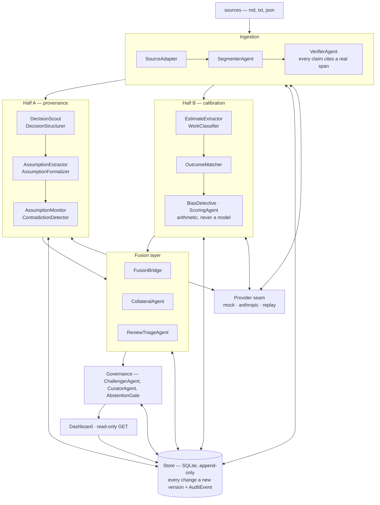
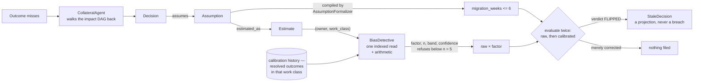

   # Welcome to Praxis

**Decisions and estimates are the same kind of object, so Praxis makes them
argue with each other.** A decision is captured with the assumptions it rests
on, each compiled into a predicate that expires; every quantified
forward-looking claim is logged as a prediction and scored when reality arrives.
Because most decision assumptions *are* estimates in disguise, calibration data
can invalidate a decision, and a missed estimate can be traced forward to every
decision that leaned on it.

Nothing else in the toolchain asks the question this makes possible: *given how
wrong this person usually is about this kind of work, is this decision still
standing on solid ground?*

---

## Quickstart — from a clean clone to a real finding

No API key, no account, no network after the install. `PRAXIS_LLM_PROVIDER=mock`
is the default and the primary path, not a fallback — CI runs on it too.

```bash
git clone https://github.com/SihanUdayaratna03/praxis.git && cd praxis
uv sync --all-groups          # fetches Python 3.12 and every dependency
uv run praxis init            # create the store
uv run praxis demo seed       # load Praxis's own history into it
```

`praxis demo seed` reads this repository's own `docs/adr/` and `docs/dogfood/` —
37 architecture decisions, the 152 assumptions they rest on, and 13 phase
estimates with their outcomes. It writes 621 records and runs the monitor:

```
152 predicate(s) evaluated against docs/dogfood/facts.json — 1 breached
  The predicate `segmenter_f1 - paragraph_floor_f1 >= 0.05` evaluated false
  against the facts this run was given, so the assumption "Block grouping
  extracts better than the deterministic paragraph floor" no longer holds.
  Resting on it: D-0011.
```

**That is a real finding about this repository, not a fixture.** ADR 0011 chose
learned segmentation over a paragraph grid and staked the choice on a number
nobody could measure yet. The eval harness later measured it: both approaches
scored an identical F1 of 0.1250, a difference of 0.0000 against a required
0.05, and the decision resting on it is now flagged for review by the system it
is part of. The write-up is in
[`docs/reports/phase-10.md`](docs/reports/phase-10.md).

Then look at it:

```bash
uv run praxis serve           # http://127.0.0.1:8000
```

Eight read-only views over the same store: the decisions and what each assumes,
assumption health, the calibration lens, the review queue, the append-only audit
trail. The API declares no HTTP method but `GET`, and a test asserts it.

```bash
uv run praxis calibrate       # what this project's estimates say about its author
uv run praxis doctor          # verify the install needs no credentials
uv run praxis config          # resolved settings and the model routing table
```


**Four refusals beside one answer is the product working, not failing.**
`BiasDetective` will not state a factor below five resolved outcomes and there
is no override —
[ADR 0024](docs/adr/0024-dispersion-widens-the-band-and-only-n-refuses.md).

Structured logs go to stderr, so `2>/dev/null` gives you the tables alone.

**Where the store goes.** One per user by default, not one per checkout —
`%LOCALAPPDATA%\praxis` on Windows, `~/.local/share/praxis` elsewhere — so two
clones share it
([ADR 0010](docs/adr/0010-store-location-under-a-syncing-filesystem.md) explains
why it is deliberately not the working directory). Seeding a store that already
holds decisions is **refused**, not repeated, because the store is append-only.
Point `PRAXIS_DATA_DIR` at an empty directory, or `cp .env.example .env` to keep
one store per checkout.

---

## Architecture

Ingestion verifies, both halves read the store, and the fusion layer is the only
component that needs both.



The store and the provider seam are the spine: nothing enters the store without
passing `VerifierAgent`, and nothing reaches a model except through
`LLMProvider`. Full detail in [`ARCHITECTURE.md`](ARCHITECTURE.md).

### The fusion mechanism

The judgement is made once, early, and written down as an edge; everything after
it is arithmetic. A finding is raised **only if the verdict flipped** — the raw
estimate satisfied the predicate and the calibrated one violates it.



Two properties keep it honest: only `praxis.predicates` — a total three-valued
evaluator — can reach a violation, so no model can declare a breach
([ADR 0019](docs/adr/0019-only-arithmetic-can-breach-and-writes-happen-on-change.md));
and a calibrated flip is filed as a `StaleDecision`, never an
`AssumptionBreach`, because nothing has been measured yet
([ADR 0028](docs/adr/0028-a-projection-is-not-a-breach.md)). The mechanism, the
refusals and what is *not* built are set out in
[`docs/FUSION.md`](docs/FUSION.md).

---

## Runs with no API key, by design

| Provider | Use |
| -------- | --- |
| `mock` *(default)* | Deterministic, offline, zero credentials. Drives the full pipeline, test suite, eval harness, CLI and dashboard. |
| `anthropic` | Live models. |
| `replay` | Replays recorded responses from fixture files. |

Switching is one environment variable: `PRAXIS_LLM_PROVIDER=mock | anthropic |
replay`. This is not a workaround for a missing key. Agent systems are only
testable if the model layer is swappable and reproducible: deterministic replay
is what lets CI assert on agent behaviour, what makes evaluation results
comparable between commits, and what makes a bug reproducible rather than
anecdotal.

Offline, the extraction numbers measure the plumbing rather than a model, and
the reports say so beneath their own tables.

---

## State

| | |
| --- | --- |
| Tests | **3431 passed**, coverage **98.57%** (gate 85%) |
| ADRs | **37**, each written in Praxis's own schema |
| ADR predicates that parse | 151 of 152 — **0.9934** |
| Store schema | version 4 |
| Demo store | 621 records, 1 breach |

Run the checks exactly as CI does:

```bash
uv run ruff check . && uv run ruff format --check .
uv run mypy                   # strict, over praxis/
uv run pytest
```

### The extraction pipeline, on a synthetic corpus

To watch the agents read documents rather than seed from committed history:

```bash
export PRAXIS_DATA_DIR=.praxis-corpus                # a second store, not the demo's
uv run praxis init
uv run praxis corpus generate .praxis-tmp/corpus     # 82 documents + answer key
uv run praxis ingest .praxis-tmp/corpus/documents    # documents -> verified spans
uv run praxis extract                                # spans -> decisions, assumptions, estimates
uv run praxis eval .praxis-tmp/corpus                # grade it against the key
uv run praxis eval .praxis-tmp/corpus --ablate       # and rung by rung
```

`--ablate` grades seven cumulative rungs, each in a store of its own, so every
component's contribution is a row rather than an assertion.

---

## Repository layout

```
praxis/          library and CLI (the only place typed business logic lives)
  agents/        every agent, and the arithmetic ones that must never call a model
  config/        settings loader and the single source of truth for model IDs
  corpus/        the synthetic corpus generator and its machine-gradeable key
  demo/          seeding a store from this repository's own committed history
  domain/        the records, typed ids, spans and edge types
  eval/          the harness, the metrics and the ablation ladder
  ingest/        adapters, segmentation and the citation verifier
  llm/           the provider interface: mock, anthropic, replay, and the traces
  monitor/       evaluating assumptions against facts, and what a breach is
  obs/           structured logging
  predicates/    the small total predicate language: lexer, parser, evaluator
  prompts/       prompts as versioned stored artefacts
  store/         SQLite schema, migrations, repository, append-only audit trail
  web/           the read-only FastAPI layer and the dashboard it serves
tests/           pytest + hypothesis
docs/adr/        architecture decision records, written in Praxis's own schema
docs/reports/    one report per phase: what shipped, what the metrics said
docs/dogfood/    Praxis's predictions about its own construction, and the facts
```

---

## Going deeper

| | |
| --- | --- |
| [`docs/PITCH.md`](docs/PITCH.md) | Twenty minutes: the demo, the four things worth looking at, and what is not true yet |
| [`ARCHITECTURE.md`](ARCHITECTURE.md) | Every component, what is built, and the data model |
| [`docs/FUSION.md`](docs/FUSION.md) | The claim the product exists to make, and what is not built |
| [`docs/adr/`](docs/adr/) | 37 decisions with their assumptions, predicates and expiry conditions |
| [`docs/reports/`](docs/reports/) | What each phase delivered and what the metrics said |
| [`BACKLOG.md`](BACKLOG.md) | Known work, with the reason it was deferred |

---


## License

MIT — see [LICENSE](LICENSE).
